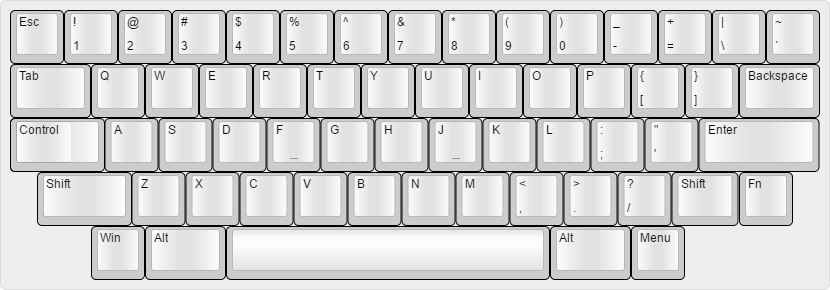
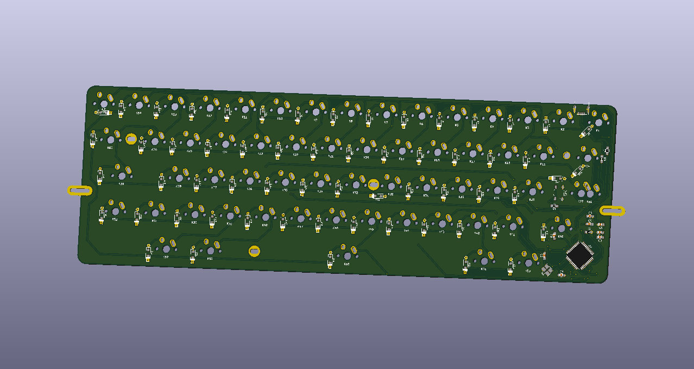

# MX_HHKB
Mechanical keyboard based on HHKB layout

## About

Just another fun(?) keyboard with HHKB layout. Designed to fit in some 60% Poker cases.

Can accept normal caps lock or stepped. No Backlight or RGB leds, just 2 leds on Caps lock and Esc.

All caps are in standard size to increase choice of keysets!

## Firmware
All firmware we can drive an ATMEGA32U4 (QMK, TMK and other forks)

### Used PINs
* Col0: B0
* Col1: B3
* Col2: B2
* Col3: B1
* Col4: D5
* Col5: D4
* Col6: B6
* Col7: B7
* Col8: C7
* Col9: D3
* Col10: D0
* Col11: D1
* Col12: D2
* Row0: C6
* Row1: B5
* Row2: B4
* Row3: D6
* Esc led: F0
* Caps led: F1

### Unused PIN:
* E6
* F4
* F5
* F6
* F7

## Third party
Libraries and Footprint are provided by Hasu and /u/techieee.

## External links

* PCB guide: https://github.com/ruiqimao/keyboard-pcb-guide
* Hasu's lib: https://github.com/tmk/kicad_lib_tmk
* Hasu's footprint https://github.com/tmk/keyboard_parts.pretty
* /u/techieee's footprint: https://github.com/egladman/keebs.pretty
* Plate generator: http://builder.swillkb.com/
