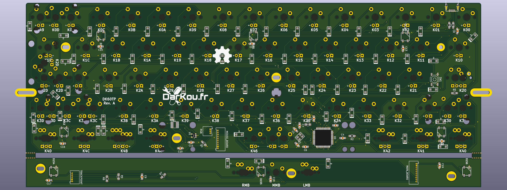

# DK60 / DK60TP
Mechanical keyboard based on HHKB layout withor without Trackpoint.

## About

Just another fun(?) keyboard with HHKB layout.

Can accept normal caps lock or stepped. No Backlight or RGB leds, just 2 leds on Caps lock and Esc.

All caps are in standard size to increase choice of keysets!

## DK60
Designed to fit in some 60% Poker cases.

Bottom row:
* 1U - 1.5U - 6.25U - 1.5U - 1U
* 1U - 1.5U - 6U - 1.5U - 1U
* 1U - 1.25U - 7U - 1.25U - 1U

## DK60TP
:warning: Still in development :warning:

Need a custom case...

Extended version of DK60 with integrated IBM Trackpoint.

Bottom row:
* 1U - 1.5U - 6U - 1.5U - 1U

## Firmware
All firmware we can drive an ATMEGA32U4 (QMK, TMK and other forks).

## Third party
Libraries and Footprint are provided by Hasu and /u/techieee.

## External links

* PCB guide: https://github.com/ruiqimao/keyboard-pcb-guide
* Hasu's lib: https://github.com/tmk/kicad_lib_tmk
* Hasu's footprint https://github.com/tmk/keyboard_parts.pretty
* /u/techieee's footprint: https://github.com/egladman/keebs.pretty
* Plate generator: http://builder.swillkb.com/
