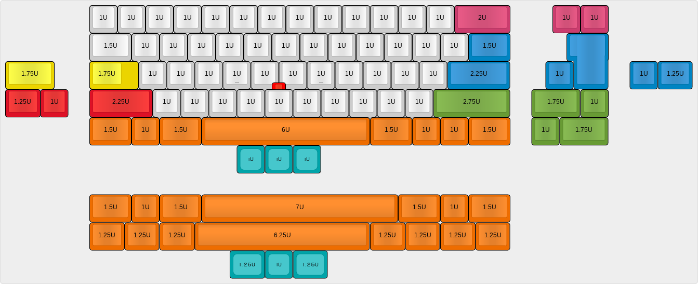
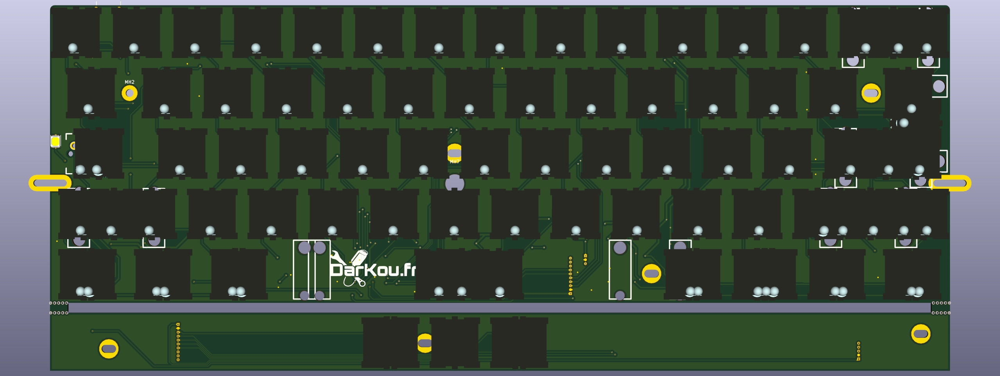

# DK60 / DK60TP
Mechanical keyboard based on HHKB layout withor without Trackpoint.

## About

Just another fun(?) keyboard with HHKB layout.

Can accept normal caps lock or stepped. No Backlight or RGB leds, just 2 leds on Caps lock and Esc.

All caps are in standard size to increase choice of keysets!

## DK60
Designed to fit in some 60% Poker cases.

Bottom row:
* 1U - 1.5U - 6.25U - 1.5U - 1U
* 1U - 1.5U - 6U - 1.5U - 1U
* 1U - 1.25U - 7U - 1.25U - 1U

## DK60TP
:warning: Still in development :warning:

DK60TP is just a big update of DK60 with support for IBM Trackpoint.

My goal is to recreate a Tex Yoga like but with many custom layouts.

Electronic is divided in 3 parts:
* Keyboard PCB (compatible with some 60% Poker cases)
* Mouse buttons PCB
* IBM Trackpoint

## Firmware
DK60 is officially supported by QMK: https://github.com/qmk/qmk_firmware/tree/master/keyboards/dk60
DK60TP still in development and does not have actually associate firmware.

## Third party
Libraries and Footprint are provided by Hasu and /u/techieee.

## Used software
I've only used Open Source software for Electronic and Cases.

List of used softwares:
* OS: Debian
* Kicad
* QCad
* Freecad

## External links

* PCB guide: https://github.com/ruiqimao/keyboard-pcb-guide
* Hasu's lib: https://github.com/tmk/kicad_lib_tmk
* Hasu's footprint https://github.com/tmk/keyboard_parts.pretty
* /u/techieee's footprint: https://github.com/egladman/keebs.pretty
* Plate generator: http://builder.swillkb.com/
